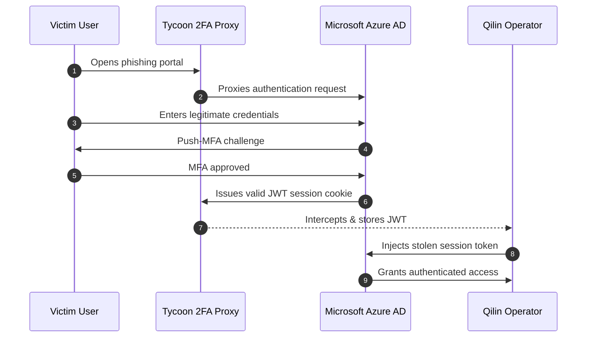
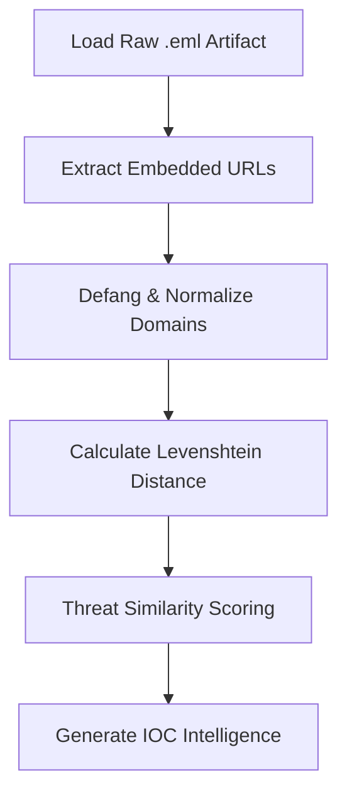

# 🔬 DFIR ARTIFACTS — TYCOON 2FA DECONSTRUCTION

<div align="center">

# ⚠️ ADVERSARY-IN-THE-MIDDLE FORENSIC ANALYSIS

### *Reverse Proxy MFA Interception & Session Hijacking*


<br>


</div>

---

# 📁 FORENSIC ENVIRONMENT

| Component              | Specification                                                   |
| ---------------------- | --------------------------------------------------------------- |
| **Classification**     | `TLP:AMBER`                                                     |
| **Operating System**   | Arch Linux (Kernel 6.x)                                         |
| **Repositories**       | BlackArch                                                       |
| **Window Manager**     | Hyprland                                                        |
| **Analysis Objective** | Reverse-engineer the AitM phishing chain that bypassed Push-MFA |

---

# 🧠 INCIDENT OVERVIEW

The compromise of Aegis Logistics was not initiated through:

* ransomware
* credential dumping
* malware exploitation
* endpoint compromise

Instead, the adversary weaponized:

<div align="center">

# 🍪 AUTHENTICATED TRUST

</div>

---

# ☠️ 1. THE THREAT — TYCOON 2FA

## What Is Tycoon 2FA?

**Tycoon 2FA** is an advanced:

```yaml
Attack Class: Adversary-in-the-Middle (AitM)
Mechanism: Reverse Proxy Phishing Framework
Objective: Session Cookie Theft
Primary Target: MFA-Protected Cloud Identities
```

Unlike traditional phishing kits that merely steal usernames and passwords, Tycoon operates as a **transparent authentication relay** between the victim and the legitimate Microsoft Azure AD infrastructure.

---

<div align="center">

# 🔄 REAL-TIME IDENTITY INTERCEPTION

</div>

---

# ⚡ Attack Chain Breakdown



---

# 🧬 Why This Attack Was So Dangerous

Traditional phishing:

```diff
- Steals credentials
- Often blocked by MFA
```

Tycoon 2FA:

```diff
+ Steals authenticated sessions
+ Completely bypasses MFA
+ Generates minimal EDR telemetry
+ Appears as legitimate user activity
```

---

# 🔐 THE CRITICAL FAILURE

> Push-MFA verified the *user*
> but never verified the *session destination*.

Because the JWT token was:

* valid
* cryptographically signed
* device-independent
* not origin-bound

…the attacker inherited a fully authenticated cloud identity.

---

<div align="center">

# 🚨 THEY NEVER BROKE MFA.

# THEY STOLE THE SESSION *AFTER* MFA.

</div>

---

# 🛠️ 2. THE TOOLING — `AitM_Deconstructor.py`

## 🎯 Objective

Conventional threat detection pipelines rely heavily on:

* static IOC matching
* regex signatures
* heuristic URL filtering

These approaches fail against:

```diff
- Obfuscated spearphishing domains
- HTML smuggling
- Unicode typosquatting
- Defanged URLs
```

To overcome this limitation, I engineered a custom forensic utility:

# ⚙️ `AitM_Deconstructor.py`

---

# 🧪 Primary Functions

| Capability         | Description                                |
| ------------------ | ------------------------------------------ |
| `.eml` Parsing     | Extracts raw email artifacts               |
| URL Deobfuscation  | Restores defanged URLs                     |
| Domain Analysis    | Identifies typosquatting patterns          |
| Entropy Inspection | Detects randomized phishing infrastructure |
| Threat Scoring     | Calculates similarity confidence           |
| IOC Extraction     | Produces actionable intelligence artifacts |

---

# 🧠 Why Standard String Matching Failed

Typical detection logic uses:

```python
difflib.SequenceMatcher()
```

This is insufficient for targeted phishing analysis because it lacks deterministic edit-distance precision.

---

# 🔬 Custom Levenshtein Implementation

Instead, the utility implements a handcrafted dynamic programming model using the:

# 🧮 LEVENSHTEIN DISTANCE ALGORITHM

The algorithm calculates:

> The exact minimum number of single-character edits required to transform one domain into another.

---

## 📐 Computational Complexity

### Time Complexity

O(|s_1| \cdot |s_2|)

### Space Complexity

O(|s_2|)

---

# 🧬 Example Analysis

```diff
LEGITIMATE DOMAIN:
aegis-logistics.com

MALICIOUS DOMAIN:
aegis-logistcs-portal.com
```

---

## ⚠️ Domain Mutation Analysis

| Mutation Type      | Observation                          |
| ------------------ | ------------------------------------ |
| Character Omission | Missing `i` in `logistics`           |
| Brand Preservation | `aegis` intentionally retained       |
| Trust Injection    | Added `portal` keyword               |
| Human Targeting    | Designed for rushed enterprise users |

---

<div align="center">

# 🧠 THIS IS NOT RANDOM TYPOGRAPHY.

# THIS IS PSYCHOLOGICAL ENGINEERING.

</div>

---

# ⚙️ Execution Workflow



---

# 🖥️ EXECUTION

## 📦 Usage

```bash
# Execute forensic deconstruction against phishing artifact
python3 AitM_Deconstructor.py \
    -f artifact_tycoon_initial.eml \
    -d aegis-logistics.com \
    --scan
```

---

# 📤 EXPECTED OUTPUT

```yaml
[+] Parsing email artifact...
[+] Extracting embedded URLs...
[+] Defanged URL restored
[+] Calculating edit distance...

-----------------------------------------
Domain Similarity Analysis
-----------------------------------------

Target Domain:
aegis-logistics.com

Observed Domain:
aegis-logistcs-portal.com

Levenshtein Distance: 2
Threat Confidence: HIGH
Typosquat Probability: 97.2%

-----------------------------------------
IOC Export Complete
-----------------------------------------
```

---

# 🧠 STRATEGIC TAKEAWAYS

## ❌ Traditional Security Assumptions Failed

We assumed:

```text
MFA = Secure Authentication
```

Attackers proved:

```text
Authenticated sessions are the true target.
```

---

# 🔐 Defensive Lessons Learned

| Legacy Thinking             | Modern Reality                          |
| --------------------------- | --------------------------------------- |
| Passwords are the perimeter | Identity sessions are the perimeter     |
| MFA stops phishing          | MFA can be proxied                      |
| EDR detects compromise      | Session theft produces little telemetry |
| Trust persists after login  | Trust must be continuously revalidated  |

---

<div align="center">

# ⚡ MODERN DEFENSE IS NOT ABOUT LOGIN SECURITY.

# IT IS ABOUT SESSION INTEGRITY.

</div>

---

# 🛡️ RECOMMENDED MITIGATIONS

## Immediate Controls

```diff
+ Enforce FIDO2 hardware-backed authentication
+ Deploy Continuous Access Evaluation (CAE)
+ Bind tokens to compliant devices
+ Disable legacy Push-MFA flows
+ Implement impossible-travel revocation
+ Restrict session portability
```

---

# 🔚 CONCLUSION

Tycoon 2FA represents the evolution of phishing from:

```diff
- Credential Theft
```

to:

```diff
+ Identity Session Hijacking
```

This attack succeeded because the enterprise trusted:

* mathematically valid tokens
* implicitly trusted sessions
* legacy MFA assumptions

The future of enterprise defense will not be determined by:

> who logs in

…but by:

> whether the session itself can still be trusted.

---

<div align="center">

# 🧬 END OF DFIR ANALYSIS

### `Identity is the New Attack Surface`

</div>
