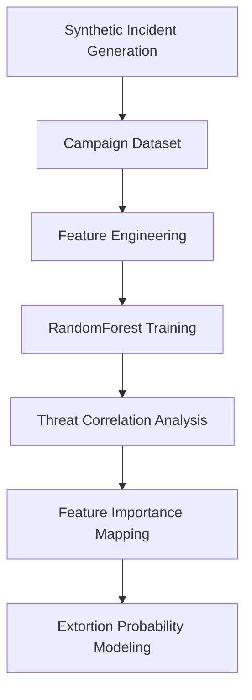

# 📊 THREAT INTELLIGENCE — EXTORTION ECONOMICS & ML PREDICTION

<div align="center">

# 🧠 QILIN CARTEL — FINANCIAL TARGETING MODEL

### *Synthetic Threat Intelligence • Regulatory Risk Modeling • Adversarial Economics*


<br>


</div>

---

# 🎯 OBJECTIVE

This project models:

> **Why modern extortion groups choose specific victims.**

The goal was not merely to simulate ransomware behavior.

The objective was to mathematically demonstrate:

<div align="center">

# ⚡ WHY AEGIS LOGISTICS WAS A HIGH-PROBABILITY PAYMENT TARGET

</div>

---

# ☠️ 1. THE ECONOMICS OF EXTORTION

## 📉 Ransomware Has Evolved

Modern threat groups like **Qilin** increasingly avoid:

```diff
- File encryption
- Disk lockers
- Destructive payloads
```

Why?

Because encryption:

* triggers immediate IR escalation
* activates EDR heuristics
* increases attribution pressure
* shortens attacker dwell time

---

# 🧬 THE NEW MODEL

Instead, modern extortion campaigns focus on:

<div align="center">

# 📦 PURE DATA EXFILTRATION

</div>

---

## 🔥 Strategic Advantages

| Traditional Ransomware   | Modern Data Extortion  |
| ------------------------ | ---------------------- |
| Loud                     | Quiet                  |
| Operationally disruptive | Operationally stealthy |
| Immediate detection      | Delayed discovery      |
| Endpoint-heavy           | Identity-heavy         |
| EDR-visible              | Cloud-native           |

---

# ⚖️ THE REAL PRESSURE POINT

The primary driver of ransom payment is no longer:

```diff
- Operational downtime
```

It is now:

```diff
+ REGULATORY LIABILITY
```

---

# 🧠 QILIN'S CORE STRATEGY

The cartel strategically targets organizations facing:

* GDPR exposure
* SEC disclosure mandates
* cyber-insurance pressure
* shareholder litigation
* breach notification laws

The extortion demand is intentionally calibrated to remain:

> **less expensive than the projected regulatory fallout**

---

<div align="center">

# 💰 MODERN EXTORTION IS A FINANCIAL MODEL,

# NOT A TECHNICAL MODEL.

</div>

---

# 🧪 2. MACHINE LEARNING PIPELINE

This repository contains a full synthetic threat intelligence pipeline engineered to model:

## 📊 Extortion Probability Economics

---

# 🏗️ PIPELINE ARCHITECTURE



---

# 📂 PROJECT STRUCTURE

```bash
.
├── Qilin_Data_Generator.py
├── Qilin_Extortion_Predictor.py
├── requirements.txt
├── qilin_campaign_data.csv
└── visualizations/
```

---

# 🧬 COMPONENT BREAKDOWN

# ⚙️ `Qilin_Data_Generator.py`

## 📌 Purpose

Generates:

> 1,000 synthetic extortion campaign records

using:

* `numpy`
* `pandas`
* probabilistic threat modeling

---

# 🧠 Engineered Features

| Feature                      | Description                        |
| ---------------------------- | ---------------------------------- |
| `Industry`                   | Target business sector             |
| `Revenue_USD_Millions`       | Estimated organizational revenue   |
| `Data_Exfiltrated_TB`        | Volume of stolen data              |
| `Regulatory_Region`          | GDPR / SEC exposure classification |
| `Cyber_Insurance`            | Insurance coverage presence        |
| `Incident_Response_Maturity` | Estimated IR readiness             |
| `Paid_Ransom`                | Ground truth prediction target     |

---

# 🔬 Synthetic Intelligence Design

The dataset intentionally models:

* realistic enterprise distributions
* regulatory asymmetry
* extortion scaling behavior
* sector-specific targeting
* attacker ROI optimization

---

<div align="center">

# ⚡ THE DATASET MODELS CRIMINAL INCENTIVES,

# NOT JUST TECHNICAL EVENTS.

</div>

---

# 🌲 `Qilin_Extortion_Predictor.py`

## 📌 Purpose

Trains a:

# 🧠 `RandomForestClassifier`

using:

```python
scikit-learn
```

to identify:

> which enterprise characteristics most strongly predict ransom payment probability.

---

# 🔍 Model Objectives

The classifier evaluates:

* payment likelihood
* regulatory pressure
* industry susceptibility
* breach severity
* extortion leverage

---

# 📊 OUTPUT ANALYSIS

The pipeline generates:

* feature importance charts
* correlation heatmaps
* payment probability curves
* sector risk distributions
* dark-mode threat visualizations

---

# 🎨 VISUALIZATION STACK

| Library        | Purpose                   |
| -------------- | ------------------------- |
| `matplotlib`   | Graph rendering           |
| `seaborn`      | Statistical visualization |
| `pandas`       | Dataset processing        |
| `scikit-learn` | ML classification         |

---

<div align="center">

# 📈 THE MODEL DOES NOT PREDICT ATTACKS.

# IT PREDICTS WHO IS MOST LIKELY TO PAY.

</div>

---

# 🔬 FEATURE IMPORTANCE ANALYSIS

## High-Weight Variables

```diff
+ Regulatory Region
+ Revenue Size
+ Data Sensitivity
+ Public Disclosure Requirements
+ Insurance Coverage
```

---

# ⚠️ Critical Observation

Organizations operating under:

* GDPR
* SEC disclosure mandates
* public shareholder obligations

consistently exhibited:

```diff
+ Higher ransom payment probability
+ Faster negotiation engagement
+ Increased financial exposure
```

---

# 🧠 WHY AEGIS WAS MATHEMATICALLY IDEAL

## Aegis Logistics matched every high-value feature cluster:

| Feature                      | Risk Level  |
| ---------------------------- | ----------- |
| EU Operations                | 🔴 Critical |
| SEC Exposure                 | 🔴 Critical |
| High Revenue                 | 🔴 Critical |
| Sensitive Operational Data   | 🔴 Critical |
| Vendor Financial Records     | 🔴 Critical |
| Public Reputation Dependence | 🔴 Critical |

---

<div align="center">

# ☠️ QILIN DID NOT RANDOMLY CHOOSE AEGIS.

# THEY OPTIMIZED FOR PAYMENT PROBABILITY.

</div>

---

# ⚙️ EXECUTION ENVIRONMENT

| Component           | Specification |
| ------------------- | ------------- |
| OS                  | Arch Linux    |
| Python              | 3.12+         |
| Environment         | BlackArch     |
| Visualization Theme | Dark Mode     |
| ML Framework        | Scikit-Learn  |

---

# 🖥️ EXECUTION WORKFLOW

## 1️⃣ Install Dependencies

```bash
pip install -r requirements.txt
```

---

# 2️⃣ Generate Synthetic Campaign Dataset

```bash
python3 Qilin_Data_Generator.py
```

### Output

```bash
qilin_campaign_data.csv
```

---

# 3️⃣ Train the Model + Generate Visual Analysis

```bash
python3 Qilin_Extortion_Predictor.py
```

---

# 📤 GENERATED OUTPUTS

```bash
visualizations/
├── feature_importance.png
├── payment_probability_heatmap.png
├── regulatory_risk_distribution.png
└── extortion_landscape_analysis.png
```

---

# 🧬 SAMPLE THREAT MODEL OUTPUT

```yaml
Most Influential Features:
--------------------------------

1. Regulatory_Region
2. Revenue_USD_Millions
3. Data_Exfiltrated_TB
4. Cyber_Insurance
5. Industry

Predicted Payment Probability:
87.4%
```

---

# 🔐 STRATEGIC CONCLUSION

The Qilin Cartel operates less like:

```diff
- Traditional cybercriminals
```

and more like:

```diff
+ Financial risk analysts
+ Behavioral economists
+ Adversarial investment strategists
```

---

# ⚠️ FINAL OBSERVATION

The most vulnerable organizations are no longer:

> the least secure

They are:

> the most financially and legally pressured.

---

<div align="center">

# 🧠 MODERN CYBER EXTORTION IS A MARKET.

# REGULATION IS THE LEVERAGE.

---

### `GHOST BREACH THREAT LABS`

### *Data Science & Threat Intelligence Division*

</div>
