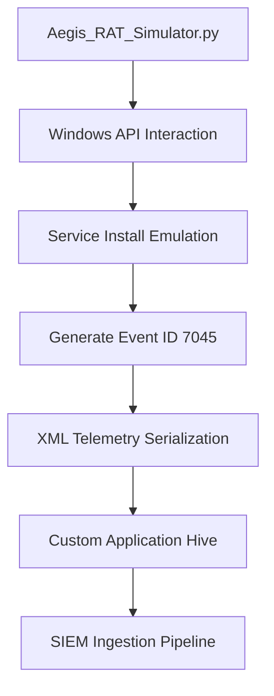
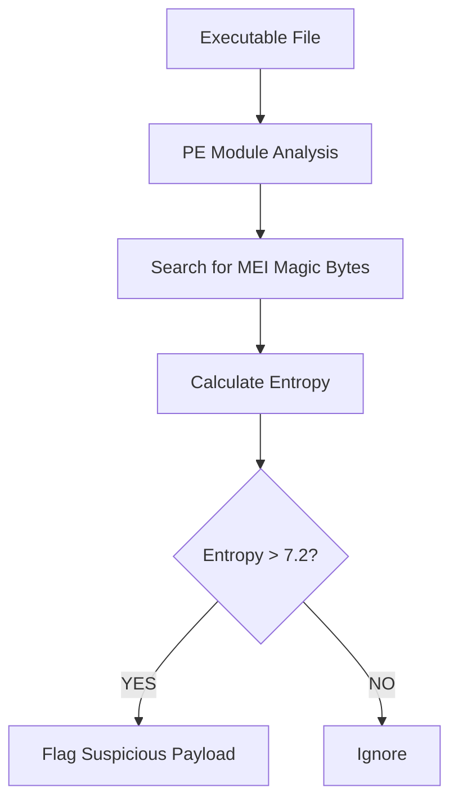

# 🛡️ DETECTION ENGINEERING — TELEMETRY & HEURISTICS

<div align="center">

# ⚡ ADVERSARY TELEMETRY SIMULATION & YARA HEURISTICS

### *Persistence Detection • SIEM Validation • Packed Payload Analysis*


<br>


</div>

---

# 🎯 OBJECTIVE

This directory contains:

* persistence telemetry simulation tooling
* SIEM validation artifacts
* heuristic malware detection logic
* packed executable identification techniques

The objective is not malware deployment.

It is:

<div align="center">

# 🧠 SAFE DETECTION ENGINEERING

</div>

---

# ☠️ 1. THE THREAT MODEL

During the Aegis Logistics compromise, the Qilin Cartel established persistence using:

```yaml id="d3n8mk"
Payload Type: PyInstaller-Packed Python RAT
Executable Name: AegisSys.exe
Persistence Method: Windows Service Installation
Primary Telemetry: Event ID 7045
```

---

# 🧬 WHY EVENT ID 7045 MATTERS

## 📌 Event ID 7045

Represents:

> A new Windows service being installed.

This event is extremely valuable because many malware families:

* establish persistence via SCM
* masquerade as legitimate services
* survive reboots
* evade user visibility

---

# ⚠️ ATTACKER ADVANTAGE

Threat actors frequently abuse:

```diff id="o1ek9v"
+ Service Control Manager (SCM)
+ Windows Registry Service Keys
+ Auto-start service bindings
+ SYSTEM-level execution
```

This creates:

* persistent access
* elevated execution context
* reliable beacon recovery

---

<div align="center">

# 🔥 PERSISTENCE IS NOT ABOUT MALWARE.

# IT IS ABOUT SURVIVING REBOOT.

</div>

---

# ⚙️ 2. TELEMETRY SIMULATOR — `Aegis_RAT_Simulator.py`

## 🎯 Purpose

To validate:

* SIEM ingestion pipelines
* detection engineering rules
* correlation logic
* SOC alert fidelity

without executing live malicious code.

---

# 🧠 SAFE SIMULATION DESIGN

The utility safely interacts with:

```yaml id="rt7l1u"
Windows API
Service Control Manager
Application Event Logging
Custom Event XML Serialization
```

to generate:

# 📊 MATHEMATICALLY ACCURATE EVENT ID 7045 TELEMETRY

---

# 🧬 GENERATED ARTIFACTS

| Artifact                  | Purpose                         |
| ------------------------- | ------------------------------- |
| Event ID 7045             | Service Installation Simulation |
| XML Event Payload         | SIEM Parsing Validation         |
| Registry Service Bindings | Persistence Emulation           |
| Application Hive Logging  | Secure Detection Testing        |

---

# 🏗️ TELEMETRY FLOW



---

# ⚠️ WHY THIS MATTERS

Many detection teams test rules using:

```diff id="12msjq"
- Static sample logs
- Artificial JSON blobs
- Unrealistic telemetry
```

This results in:

* parser failures
* incorrect field extraction
* broken enrichment pipelines
* false confidence

---

# 🔬 THE GOAL

Generate telemetry that is:

```diff id="j1jlwm"
+ Structurally authentic
+ SIEM-compatible
+ Field-accurate
+ Operationally safe
```

---

# 🖥️ EXECUTION

## Generate Event ID 7045 Simulation

```bash id="n8zy6o"
python3 Aegis_RAT_Simulator.py --simulate-7045
```

---

# ⚠️ Administrative Note

For full registry/service binding simulation:

```diff id="sq2i7s"
+ Run as Administrator
```

---

# 🧬 EXPECTED EVENT CHARACTERISTICS

| Field           | Example                       |
| --------------- | ----------------------------- |
| Event ID        | `7045`                        |
| Service Name    | `AegisSys`                    |
| Image Path      | `C:\ProgramData\AegisSys.exe` |
| Start Type      | `Auto Start`                  |
| Service Account | `LocalSystem`                 |

---

# 📤 SAMPLE XML OUTPUT

```xml
<Event>
  <System>
    <EventID>7045</EventID>
    <Provider Name="Service Control Manager"/>
  </System>

  <EventData>
    <Data Name="ServiceName">AegisSys</Data>
    <Data Name="ImagePath">
      C:\ProgramData\AegisSys.exe
    </Data>
    <Data Name="StartType">Auto Start</Data>
  </EventData>
</Event>
```

---

<div align="center">

# ⚡ GOOD DETECTION ENGINEERING REQUIRES

# REALISTIC TELEMETRY.

</div>

---

# 🧬 3. HEURISTIC DETECTION — YARA

## 📌 Why Hash Matching Fails

Traditional AV pipelines often rely on:

```diff id="f8skvy"
- SHA256 signatures
- Static IOC matching
- Known malware hashes
```

Modern adversaries bypass this easily through:

* repacking
* obfuscation
* polymorphism
* minor binary modifications

---

# ☠️ THE QILIN APPROACH

The payload used during the Aegis breach was:

```yaml id="tq0xvw"
Format: PyInstaller Executable
Language: Python
Packing Method: Embedded Bootloader Archive
Objective: Evasion & Portability
```

---

# ⚡ DETECTION STRATEGY

Instead of static hashes, the included YARA rule:

# 🧠 `SUSP_PyInstaller_Aegis_RAT_Sim.yar`

uses:

* structural heuristics
* entropy analysis
* PE inspection
* bootloader artifact detection

---

# 🧬 YARA MODULES UTILIZED

| Module     | Purpose                      |
| ---------- | ---------------------------- |
| `pe`       | Portable Executable analysis |
| `math`     | Entropy calculation          |
| `filesize` | Payload sizing logic         |

---

# 🔍 PRIMARY HEURISTICS

## 1️⃣ PyInstaller Bootloader Detection

The rule searches for:

```text
MEI\x00
```

This magic byte sequence is strongly associated with:

> PyInstaller extraction archives.

---

# 2️⃣ Entropy Enforcement

Packed malware often exhibits:

* compressed sections
* encrypted payloads
* randomized byte distribution

The rule therefore enforces:

Entropy > 7.2

to identify suspicious obfuscation behavior.

---

# 🧠 WHY ENTROPY MATTERS

| Entropy Range | Interpretation                         |
| ------------- | -------------------------------------- |
| `0.0 - 5.5`   | Mostly plaintext / normal binaries     |
| `5.5 - 7.0`   | Mixed executable content               |
| `> 7.2`       | Likely packed / compressed / encrypted |

---

<div align="center">

# 🔥 HIGH ENTROPY IS OFTEN

# THE SHADOW OF OBFUSCATION.

</div>

---

# 📄 YARA EXECUTION

## Recursive Directory Scan

```bash id="67jzvx"
yara -r SUSP_PyInstaller_Aegis_RAT_Sim.yar /path/to/scan/
```

---

# 🧬 DETECTION LOGIC FLOW



---

# ⚠️ STRATEGIC INSIGHT

PyInstaller itself is not malicious.

However:

```diff id="1dx9ow"
+ Packed Python payloads
+ High entropy
+ Service persistence
+ Unsigned binaries
```

together create:

# 🚨 A HIGH-FIDELITY MALWARE PROFILE

---

# 🛡️ DETECTION ENGINEERING TAKEAWAYS

| Legacy Detection  | Modern Detection              |
| ----------------- | ----------------------------- |
| Static hashes     | Behavioral heuristics         |
| Signature-only AV | Telemetry correlation         |
| IOC matching      | Statistical anomaly detection |
| Known malware IDs | Structural analysis           |

---

# 🔐 RECOMMENDED SIEM CORRELATIONS

## High-Fidelity Detection Chain

```yaml id="9mpw9n"
IF:
    Event ID 7045
AND:
    Unsigned executable
AND:
    High entropy binary
AND:
    PyInstaller artifacts present

THEN:
    Escalate as potential malicious persistence
```

---

# 🧠 FINAL OBSERVATION

The future of detection engineering is not:

> identifying known malware

It is:

> recognizing malicious behavior patterns regardless of payload mutation.

---

<div align="center">

# ⚡ MODERN MALWARE CHANGES HASHES.

# BEHAVIOR IS HARDER TO HIDE.

---

### `GHOST BREACH — DETECTION ENGINEERING DIVISION`

</div>
