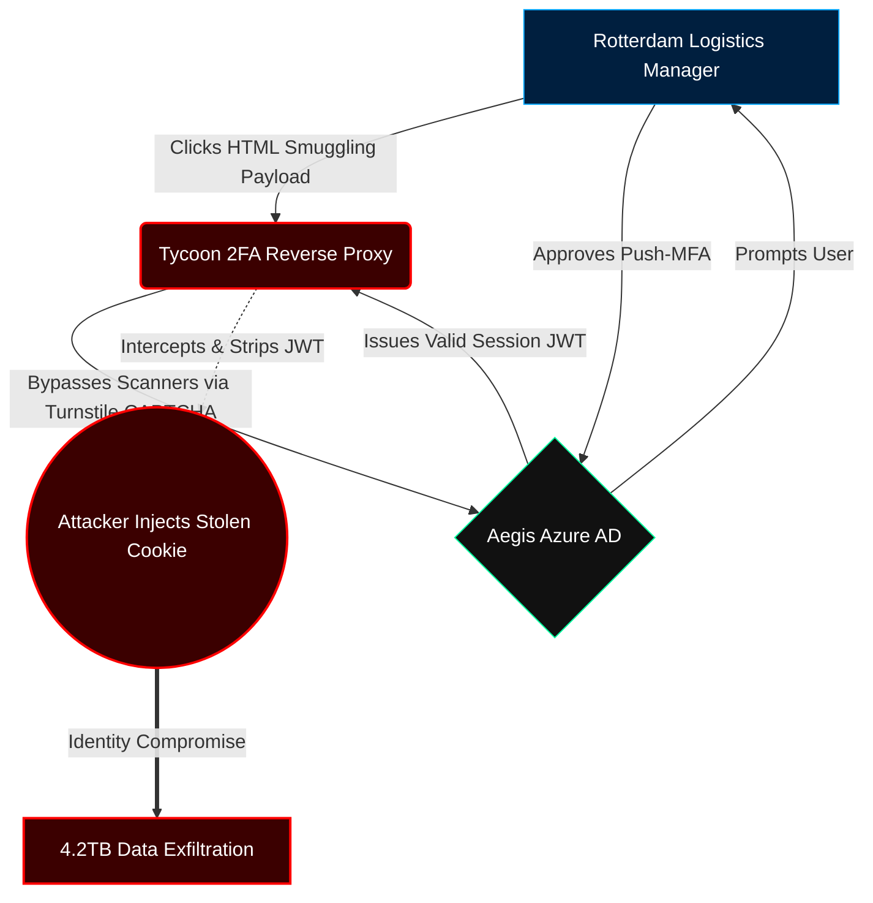

# ███████ `PRIVILEGED & CONFIDENTIAL` ███████

### *Prepared Under Direction of Outside Counsel — Attorney-Client Privilege*

<div align="center">

# ⚠️ AEGIS LOGISTICS — INCIDENT REPORT

### *Post-Breach Executive Forensics & Zero-Trust Remediation Strategy*


<br>


</div>

---

# 📑 Executive Metadata

| Field                  | Value                                                   |
| :--------------------- | :------------------------------------------------------ |
| **To**                 | Board of Directors & Risk Committee, Aegis Logistics    |
| **From**               | Office of the Chief Information Security Officer (CISO) |
| **Date**               | May 19, 2026                                            |
| **Document ID**        | `AEGIS-IR-2026-05A`                                     |
| **Classification**     | 🔒 STRICTLY CONFIDENTIAL                                |
| **Incident Type**      | Adversary-in-the-Middle (AitM) / Data Extortion         |
| **Operational Status** | Active Containment                                      |

---

# 🛑 I. BOTTOM LINE UP FRONT (BLUF)

<div align="center">

## 🚨 CRITICAL INCIDENT SUMMARY

</div>

> ### **The Incident**
>
> Aegis Logistics suffered a sophisticated **Adversary-in-the-Middle (AitM)** phishing compromise which successfully bypassed legacy Push-MFA protections.
> The **Qilin Cartel** exfiltrated **4.2TB** of Tier-1 operational and customer data.
>
> No ransomware payload was deployed.
> This was a **pure data-extortion operation**.

---

## 💥 Business Impact

```diff
- Unencrypted shipping manifests compromised
- Client Personally Identifiable Information (PII) exposed
- Vendor banking routing numbers extracted
- $4.5M extortion demand issued
```

---

## ⚖️ Regulatory Exposure

| Regulation               | Triggered Requirement                 |
| ------------------------ | ------------------------------------- |
| **SEC**                  | 4-Day Form 8-K Materiality Disclosure |
| **GDPR**                 | 72-Hour Breach Notification Window    |
| **Federal Coordination** | FBI + CISA Engagement Activated       |

---

## 🔍 Root Cause

> Our architecture protected **credentials** —
> but failed to protect **identity sessions**.

### Primary Architectural Failures

* ❌ Legacy Push-MFA reliance
* ❌ Perimeter-centric EDR assumptions
* ❌ No Continuous Access Evaluation (CAE)
* ❌ Weak Conditional Access enforcement
* ❌ Portable session tokens without binding

---

# 🏛️ II. EXECUTIVE SUMMARY — *The Illusion of Security*

> For three years, I warned this committee that our cybersecurity posture was optimized for **compliance**, not **resilience**.

We invested heavily in endpoint detection while fundamentally neglecting the identity perimeter.

The Qilin Cartel bypassed a **$2.5M EDR stack** without deploying a single zero-day exploit.

Instead, they used:

```yaml
Framework: Tycoon 2FA
Technique: Session Cookie Interception
Target: Senior Logistics Manager (Rotterdam)
Result: Full authenticated identity takeover
```

---

<div align="center">

# 🍪 THEY DID NOT STEAL A PASSWORD.

# THEY STOLE TRUST.

</div>

---

By intercepting the authenticated session cookie:

```text
They became the user.
```

This transformed the attack from a traditional intrusion into an **identity-native compromise**.

---

## ⚠️ Executive Liability Warning

Recent SEC enforcement actions demonstrate:

> Ignorance of architectural weakness is no longer considered a valid defense.

Without immediate Zero-Trust transformation:

* Regulatory fines become inevitable
* Class-action litigation becomes probable
* Cyber-insurance protection may collapse
* Enterprise trust erosion becomes permanent

---

# 🔬 III. ATTACK PATH FORENSICS & ARCHITECTURAL FAILURES

<div align="center">

## 🎯 The Adversary Never “Hacked” Us

### They exploited trust assumptions built into our infrastructure.

</div>

---

# 🧠 A. Tycoon 2FA Interception Flow



---

# 🧬 B. MITRE ATT&CK Kill Chain Analysis

| Phase                 | MITRE Technique                     | Forensic Reality                                       | Architectural Failure                      |
| --------------------- | ----------------------------------- | ------------------------------------------------------ | ------------------------------------------ |
| **Initial Access**    | `T1566.002` — Spearphishing         | HTML smuggling payload deployed obfuscated `.LNK` file | SEG URL rewriting ineffective              |
| **Credential Access** | `T1539` — Steal Web Session Cookie  | Push-MFA approved; JWT intercepted                     | No token binding / weak Conditional Access |
| **Execution**         | `T1059` — Command Shell             | PowerShell cradle fetched PyInstaller RAT              | AppLocker left in Audit Mode               |
| **Defense Evasion**   | `T1070` — Indicator Removal         | Security Event Logs cleared                            | EDR exclusions weakened detection          |
| **Exfiltration**      | `T1567.002` — Exfiltration to Cloud | `rclone` pushed 4.2TB to Mega.nz                       | DLP lacked anomaly baselining              |

---

# ☠️ IV. ROOT CAUSE — *The Identity Delusion*

<div align="center">

## 🔑 We Built Security Around Passwords

## While Attackers Built Attacks Around Sessions

</div>

---

Our organization assumed:

```text
"If MFA is approved, the user must be legitimate."
```

That assumption is now obsolete.

---

## ❌ Why Push-MFA Failed

Push-MFA verifies:

* WHO is authenticating

But it does **NOT** verify:

* WHERE the authentication terminates
* WHICH device owns the session
* WHETHER the session token remains trustworthy

---

## 🧠 The Core Failure

The stolen JWT session token was accepted because:

* it was mathematically valid
* cryptographically signed
* not device-bound
* not continuously evaluated

The attacker injected the token from Eastern Europe.

Azure AD accepted it without resistance.

---

<div align="center">

# ⚡ THE TOKEN WAS TRUSTED.

# THE USER NEVER WAS.

</div>

---

# 🗺️ V. 90-DAY ZERO-TRUST REMEDIATION ROADMAP

<div align="center">

## 🔒 From “Trust But Verify”

## ➜

## “Never Trust. Always Verify.”

</div>

---

# 💰 Budgetary Note

> This transition introduces operational friction.

A temporary:

```diff
+ 300% Global Helpdesk Expansion
```

has been budgeted to absorb authentication support demand during rollout.

---

# 🛡️ PHASE 1 — CONTAINMENT & LOCKDOWN

### *Days 1–30*

| Timeline      | Action                                                    |
| ------------- | --------------------------------------------------------- |
| **Day 1–3**   | Global token revocation + staggered password resets       |
| **Day 4–15**  | Firewall blocks on unsanctioned file-sharing APIs         |
| **Day 16–30** | FIDO2/YubiKey deployment to IT, Executives, Domain Admins |

---

## 🎯 Strategic Goal

Eliminate replayable authentication methods.

---

# 🧱 PHASE 2 — ENDPOINT HARDENING

### *Days 31–60*

| Timeline      | Action                                      |
| ------------- | ------------------------------------------- |
| **Day 31–45** | EDR moves from monitoring → enforcement     |
| **Day 31–45** | Mandatory sandboxing for unknown binaries   |
| **Day 31–45** | AppLocker transitions to Kernel Enforcement |
| **Day 46–60** | Windows Hello for Business rollout begins   |
| **Day 46–60** | SMS + Push-MFA officially deprecated        |

---

# 🌐 PHASE 3 — ZERO-TRUST ENFORCEMENT

### *Days 61–90*

| Timeline      | Action                                              |
| ------------- | --------------------------------------------------- |
| **Day 61–75** | Enforce compliant-device AND phishing-resistant MFA |
| **Day 76–90** | Continuous Access Evaluation deployment             |
| **Day 76–90** | Impossible-travel token invalidation enabled        |

---

<div align="center">

# 🔐 FINAL ACCESS POLICY

```text
ACCESS GRANTED IF:
[ PHISHING-RESISTANT MFA ]
            AND
[ COMPLIANT DEVICE ]
```

</div>

---

# 📌 CONCLUSION

The Qilin Cartel did not defeat our infrastructure with sophistication alone.

They defeated:

* outdated assumptions
* perimeter-based trust
* portable identity sessions
* operational complacency

---

## 🚧 What Happens Next

This breach will either become:

### A.

> The event that destroyed enterprise trust

### OR

### B.

> The catalyst that forced Aegis Logistics into a hardened, identity-centric future

---

<div align="center">

# ⚠️ BOARD ACTION REQUIRED

## Immediate approval requested for:

# `$1.2M OPEX`

### To execute the Zero-Trust transformation roadmap.

---

# END OF REPORT

</div>

---

# 🖥️ OPTIONAL GITHUB README ENHANCEMENTS

## Recommended Fonts

* Orbitron
* Rajdhani
* JetBrains Mono

## Recommended Additions

* Animated SVG headers
* Glitch GIF banners
* Collapsible forensic sections
* Shields.io live badges
* Dark-mode optimized diagrams

---

<div align="center">

### `Security is no longer about passwords.`

### `It is about identity integrity.`

</div>
