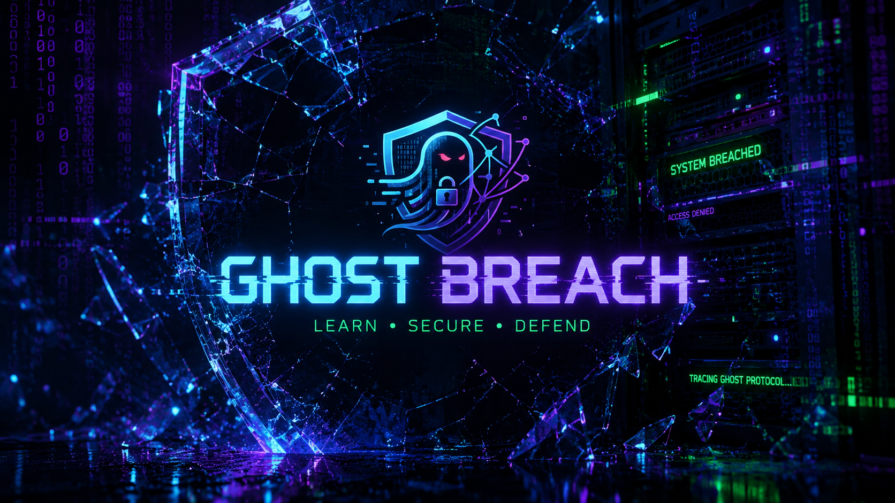

  
  

  # AEGIS LOGISTICS: APT INCIDENT SIMULATION & ZERO-TRUST REMEDIATION

  **Bridging the gap between deep technical forensics and board-level risk management.**

  
  
  

---

## 🛑 THE EXECUTIVE HOOK

Modern enterprises do not fail because they lack security tools; they fail because their security architecture is optimized for *compliance*, not *resilience*. 

This repository is a **full-spectrum cybersecurity portfolio piece**. It demonstrates my ability to not only deconstruct a highly sophisticated, identity-based cyberattack at the packet/code level, but also to translate that technical catastrophe into actionable, board-level financial strategy.

I do not just find malware. I engineer resilient architectures that render the malware irrelevant.

---

## 📂 THE SCENARIO: THE FALL OF AEGIS LOGISTICS

**Target:** Aegis Logistics ($850M Global Supply Chain Corp)
**Threat Actor:** Qilin Cartel (Financial Extortion)
**Attack Vector:** Tycoon 2FA (Adversary-in-the-Middle Phishing)
**Business Impact:** 4.2TB Data Exfiltration, $4.5M Extortion Demand, SEC 8-K Trigger.

I have simulated this entire breach from the ground up, providing the exact artifacts, telemetry, and executive communications required to triage, analyze, and remediate the disaster.

---

## 🛠️ THE ARSENAL (REPOSITORY NAVIGATION)

This repository is strictly divided into four operational domains to demonstrate full-lifecycle incident response:

### 1. [Executive Dossier: CISO Post-Mortem](./01_Executive_Post_Mortem/)
> *For the Board of Directors & Risk Committee.* > A 4-page, highly classified incident report detailing the business liability, the regulatory fallout (GDPR/SEC), and a fully budgeted 90-day Zero-Trust Remediation Roadmap.

### 2. [DFIR Artifacts: The AitM Deconstructor](./02_DFIR_Artifacts/)
> *For the Incident Responders.* > The defanged raw `.eml` artifact that bypassed the perimeter, accompanied by a custom-engineered Python tool utilizing dynamic programming (Levenshtein distance) to mathematically prove typosquatting and deconstruct the Tycoon 2FA framework.

### 3. [Threat Intelligence: Cartel Economics ML](./03_Threat_Intelligence/)
> *For the Security Architects.*
> A complete Machine Learning pipeline (RandomForestClassifier) built to analyze 1,000 synthetic parameters, proving *why* Aegis was targeted based on the cartel economics of regulatory leverage.

### 4. [Detection Engineering: RAT Telemetry](./04_Detection_Engineering/)
> *For the SOC Analysts.*
> A Python-based safe telemetry generator that injects mathematically accurate XML representations of the attacker's persistence mechanisms into the Windows Event Log for SIEM validation, alongside custom YARA rules targeting the packed payload.

---

## 🤝 HIRE ME: SECURE YOUR PERIMETER

If your organization is relying on legacy Push-MFA and perimeter-based EDR, you are functionally compromised; the attackers just haven't realized it yet.

**Let's build a network that assumes breach and mathematically guarantees containment.**

📥 **Contact Me:** ghostbreachh@gmail.com  
🌐 **YouTube:**  	www.youtube.com/@GhostBreach-mr

   
  <i>"Learn • Secure • Defend"</i>

